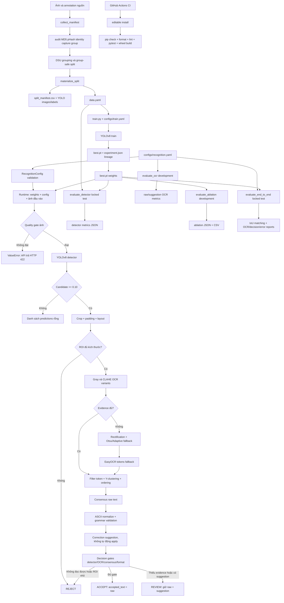

# 🚗 Vietnamese Automatic License Plate Recognition (VLPR) Platform

[](https://github.com/haminhthong/vietnamese-license-plate-recognition/actions/workflows/ci.yml)
[](https://www.python.org/)
[](https://github.com/ultralytics/ultralytics)
[](https://github.com/JaidedAI/EasyOCR)
[](https://fastapi.tiangolo.com/)
[](https://www.docker.com/)
[](LICENSE)

Hệ thống nhận diện biển số xe Việt Nam cho **ảnh tĩnh từ camera/cổng kiểm soát**, dựa trên **YOLOv8**, **OpenCV** và **EasyOCR**. Pipeline tách rõ bốn tầng: localization → raw OCR → pattern validation/suggestion → quyết định `ACCEPT`/`REVIEW`/`REJECT`.

Repository gồm package `src/`, REST API FastAPI, Web UI, CLI huấn luyện/đánh giá và Dockerfile chạy non-root. Ảnh dữ liệu, trọng số và artifact benchmark không được commit sẵn; README chỉ mô tả những gì code hiện thực.

---

## Bài toán và phạm vi ứng dụng (Problem & Scope)

Đầu vào là ảnh xe; đầu ra là danh sách tọa độ biển số, chuỗi OCR và quyết định
`ACCEPT`/`REVIEW`/`REJECT` cho từng candidate. Ứng dụng hướng đến hỗ trợ người
vận hành camera/cổng kiểm soát với ảnh tĩnh, biển dân sự một hoặc hai dòng.
Chưa triển khai video, tracking hay tích hợp điều khiển cổng. Các quy tắc định
dạng chỉ kiểm tra cú pháp; độ chính xác phải được đo bằng annotation thực tế.

## 🎯 Bảng Bằng Chứng Kỹ Thuật (Verified Evidence Matrix)

> [!IMPORTANT]
> **Phân biệt chỉ số & định dạng:**
> - **Detector mAP** (khả năng phát hiện bounding box) $\neq$ **OCR Accuracy** (độ chính xác nhận dạng chữ) $\neq$ **End-to-End Exact Recall** (độ chính xác toàn bộ pipeline từ ảnh xe đến chuỗi ký tự cuối cùng). Không dùng mAP detector để đại diện cho độ chính xác của toàn hệ thống ALPR.
> - **Format Validity** (`format_valid=True`: chuỗi khớp cú pháp rule-based Việt Nam) $\neq$ **Ground-Truth Correctness** (evaluator so sánh `accepted_prediction` với nhãn thật).
> - **EasyOCR Score** và `reliability_score` diagnostic không phải xác suất đã calibration; decision dùng các gate độc lập.

| Tuyên bố / Chỉ số | Giá trị xác minh | Artifact tái lập / Ghi chú |
|---|---:|---|
| **Detector mAP@0.50** | *Chưa công bố* | Chỉ headline khi artifact benchmark thực sự tồn tại |
| **Detector Recall@0.50** | *Chưa công bố* | Chỉ headline khi artifact benchmark thực sự tồn tại |
| **End-to-End Exact Recall** | *Chưa chạy benchmark công khai* | $E2ERecall = \frac{\text{Số biển GT phát hiện và đọc đúng 100\%}}{\text{Tổng số biển GT trong test set}}$ |
| **Exact Plate Accuracy (Raw OCR)** | *Chưa chạy benchmark công khai* | Yêu cầu file weights `models/best.pt` & dataset đầy đủ |
| **Exact Plate Accuracy (Suggestion)** | *Chưa chạy benchmark công khai* | Đề xuất chỉ là diagnostic, không tự động apply |
| **Character Error Rate (CER)** | *Chưa chạy benchmark công khai* | Artifact được tạo bởi evaluator |
| **Group Leakage Control (Protocol A)** | *Đo khi prepare dataset* | MD5/pHash/capture group được gộp trước split |
| **Plate-Identity Split (Protocol B)** | *Bắt buộc metadata* | `plate_identity` không được cross train/dev/test |
| **Ablation Benchmark** | *Chỉ trên development* | Không được dùng locked test để tune |
| **Automated Tests** | **23 test case hiện có** | Chạy `python -m pytest` sau khi cài package |

---

## 🏗️ Quy Trình Pipeline 8 Giai Đoạn Canonical (Canonical 8-Stage Pipeline)

```text
1. DATASET & LEAKAGE CONTROL
   Vehicle / Plate Images  ──► Annotation Validation ──► pHash/MD5/DSU Grouping ──► Group/Identity-Aware Train/Val/Test
                                                                                            │
2. PLATE DETECTION                                                                         ▼
   Input Image ────────────► YOLOv8 Detector ────────► Bounding Box + Confidence
                                                                                            │
3. PLATE ROI PROCESSING                                                                    ▼
   Bounding Box ───────────► Crop + Padding ──────────► Initial Layout Hint (1-line / 2-line)
                                                                                            │
4. OCR PREPROCESSING                                                                       ▼
   Padded Crop ────────────► FAST: Gray / CLAHE ──► Fallback: Rectification + Otsu / Adaptive
                                                                                            │
5. OCR RECOGNITION                                                                         ▼
   Multi-Variants ─────────► EasyOCR Extraction ─────► OCR Tokens + Geometry + Confidence
                                                                                            │
6. TEXT RECONSTRUCTION                                                                     ▼
   OCR Tokens ─────────────► Token Filtering ─────────► 1-Line / 2-Line Geometric Ordering ──► Raw Plate String
                                                                                            │
7. VIETNAMESE PLATE VALIDATION                                                             ▼
   Raw String ─────────────► ASCII Normalization ────► Supported Pattern Validation ──► Correction Suggestion
                                                                                            │
8. FINAL OUTPUT & DECISION POLICY                                                          ▼
   Raw Consensus ──────────► Explicit Gates (detector/OCR/consensus/format) ──► ACCEPT / REVIEW / REJECT
```

### Flowchart Kiến Trúc Hệ Thống và Báo Cáo (Canonical Process)



Sơ đồ này là quy trình kỹ thuật duy nhất chi phối code, cấu hình và báo cáo:
`configs/recognition.yaml` được nạp bởi API, `predict.py`,
`evaluate_ocr.py` và `evaluate_end_to_end.py`; `evaluate_ablation.py` tạo
ma trận cấu hình riêng có chủ đích để đo ảnh hưởng từng thành phần. Nhánh
`dev` chỉ dùng tuning/ablation, còn `split=test` là locked test sau khi policy
đã freeze.

### Luồng dữ liệu runtime

| Giai đoạn | Dữ liệu vào | Xử lý chính | Dữ liệu ra |
|---|---|---|---|
| Quality gate | ảnh BGR `numpy.ndarray` | kích thước, blur, phơi sáng | ảnh hợp lệ hoặc lỗi `ValueError` |
| Detection | ảnh + YOLO weights | giữ candidate, NMS | box, class, detector confidence |
| ROI | ảnh + box | crop, padding chặn biên | crop, padded box, layout |
| OCR | crop | gray/CLAHE; fallback rectification/Otsu/adaptive | token, text, confidence, variant |
| Reconstruction | token + geometry | filter, gom dòng, ordering, consensus | raw text, consensus ratio |
| Grammar | raw text | normalize ASCII, match template, suggestion | normalized text, format validity |
| Decision | mọi score/evidence | gate độc lập | decision và review reasons |

`correction_suggestion` chỉ là gợi ý ở policy `1.0.0`; `correction_applied`
luôn `false`. `accepted_text` chỉ được điền khi `decision=ACCEPT`.

---

## 📊 Báo Cáo Ablation Benchmark (Baseline Ablation)

Bảng so sánh 5 cấu hình pipeline chính cùng khảo sát tỷ lệ Crop Padding Ratios ($0\%, 3\%, 5\%, 8\%, 10\%$):

| Phiên bản | Detector | Preprocessing OCR | Nắn ảnh (Deskew) | Hậu xử lý Template | Exact Accuracy (%) | CER | Mean Latency (ms) | P95 Latency (ms) |
|---|---|---|---|---|---:|---:|---:|---:|
| **B0** | Cùng weights | Crop gốc | Không | Không | *Chưa đo* | *Chưa đo* | *Chưa đo* | *Chưa đo* |
| **B1** | Cùng weights | Gray | Không | Không | *Chưa đo* | *Chưa đo* | *Chưa đo* | *Chưa đo* |
| **B2** | Cùng weights | Gray + CLAHE rồi fallback threshold | Không | Không | *Chưa đo* | *Chưa đo* | *Chưa đo* | *Chưa đo* |
| **B3** | Cùng weights | Adaptive cascade | Fallback (Perspective) | Không | *Chưa đo* | *Chưa đo* | *Chưa đo* | *Chưa đo* |
| **Final** | YOLOv8n | Adaptive cascade | Fallback (Perspective) | Suggestion only | *Chưa đo* | *Chưa đo* | *Chưa đo* | *Chưa đo* |

---

## 🛡️ Phân Tầng Model Layer & Decision Layer (API Response Architecture)

Dịch vụ REST API tách biệt rõ giữa **Model Layer** (nhận dạng thô & độ tin cậy mô hình) và **Decision Layer** (chính sách kiểm duyệt bãi xe). Ví dụ rút gọn dưới đây lược bớt một số trường phẳng; contract đầy đủ nằm trong `app/schemas.py` và `/docs`:

```json
{
  "filename": "car_plate_sample.jpg",
  "latency_ms": 42.5,
  "predictions": [
    {
      "box": [120, 150, 310, 220],
      "padded_box": [112, 142, 318, 228],
      "class_id": 0,
      "detector_class": "license_plate",
      "detection_confidence": 0.95,
      "raw_text": "51F12B45",
      "normalized_text": "51F12B45",
      "accepted_text": null,
      "decision": "REVIEW",
      "policy_version": "1.0.0",
      "recognition": {
        "raw_text": "51F12B45",
        "normalized_text": "51F12B45",
        "text": "51F12B45",
        "format_valid": false,
        "template": "DDLDDDDD",
        "correction_cost": 1.0,
        "correction_suggestion": "51F12845",
        "correction_applied": false
      },
      "scores": {
        "detector_confidence": 0.95,
        "ocr_confidence": 0.88,
        "ocr_consensus_ratio": 0.75,
        "reliability_score": 0.645
      },
      "review": {
        "required": true,
        "reasons": ["FORMAT_INVALID", "CORRECTION_SUGGESTED"]
      },
      "latencies": {
        "image_pipeline_latency_ms": 42.5,
        "plate_ocr_latency_ms": 28.1,
        "detector_latency_ms": 14.4
      }
    }
  ]
}
```

Các trường phẳng là contract chính cho client hiện tại; các object
`recognition`, `scores`, `review`, `latencies` là bản trình bày theo tầng. Khi
`decision=ACCEPT`, `accepted_text` mới chứa raw text. Khi `REVIEW`, client nên
hiển thị raw text cùng `correction_suggestion` để operator xác nhận.

## 🗂️ Cấu trúc dự án

```text
src/
├── pipeline.py       # Detector, crop, quality gate và điều phối end-to-end
├── ocr.py            # OCR cascade, token ordering và consensus raw text
├── grammar.py        # Chuẩn hóa, template và correction suggestion
├── decision.py       # Chính sách ACCEPT / REVIEW / REJECT
├── dataset.py        # Manifest, DSU grouping và group-safe split
├── metrics.py        # IoU, OCR metrics, decision metrics và bootstrap CI
├── rectification.py  # Nắn phối cảnh fallback
└── config.py         # TrainingConfig và RecognitionConfig
app/
├── api.py            # FastAPI endpoints và response formatting
├── schemas.py        # Pydantic response contract
└── ui.html           # Dashboard upload ảnh
configs/              # Cấu hình YAML nhận diện/huấn luyện
resources/            # Template biển số và bảng nhầm lẫn OCR
tests/                # Unit/API tests
evaluate_detector.py  # Đánh giá detector trên test split
evaluate_ocr.py       # Đánh giá OCR trên development split
evaluate_end_to_end.py # Đánh giá E2E, IoU matching và error analysis
evaluate_ablation.py  # Ablation preprocessing/rectification/padding
prepare_dataset.py    # Tạo manifest, split và data.yaml
train.py              # Huấn luyện và ghi experiment lineage
predict.py            # CLI nhận diện một ảnh
export_model.py       # Export ONNX tùy chọn
.github/workflows/    # Workflow CI
pyproject.toml        # Metadata package, entrypoints, pytest, ruff
Dockerfile            # Runtime API non-root
```

Các thư mục `dataset/`, `models/`, `runs/`, `artifacts/`, `outputs/` và file
weights là dữ liệu/đầu ra cục bộ nên đã được ignore. `data/README.md` được giữ
lại vì là data card mô tả schema và chính sách dữ liệu, không phải tài liệu
trùng lặp với README này.

Các ngưỡng runtime nằm trong `configs/recognition.yaml`. Mặc định detector
giữ candidate từ `0.10`, nhưng chỉ `0.50` trở lên mới đủ gate detector cho
`ACCEPT`; OCR cần `0.65`, consensus cần `0.50`. Đây là hai mục đích khác nhau:
giữ candidate để không bỏ sót và chấp nhận tự động có kiểm soát.

### Các lý do kích hoạt kiểm duyệt thủ công (`review_reasons`):
- `LOW_DETECTION_SCORE`: Độ tin cậy phát hiện YOLOv8 thấp hơn ngưỡng cài đặt.
- `LOW_OCR_SCORE`: Độ tin cậy nhận dạng EasyOCR thấp.
- `FORMAT_INVALID`: Chuỗi raw không khớp mẫu biển số được hỗ trợ.
- `CORRECTION_SUGGESTED`: Có đề xuất sửa; policy v1 luôn yêu cầu REVIEW.
- `PLATE_TOO_SMALL`: Crop quá nhỏ, không đủ thông tin để chạy OCR.
- `VARIANT_DISAGREEMENT`: Tỷ lệ đồng thuận giữa các biến thể ảnh OCR thấp (`ocr_consensus_ratio < 0.50`).
- `UNREADABLE`: Không tạo được raw OCR có evidence.

---

## 🔒 Ngăn Ngừa Rò Rỉ Dữ Liệu (Leakage Control: Protocol A & Protocol B)

1. **Protocol A (Image-independent)**:
   - Sử dụng mã băm **MD5** và **Perceptual Hash (pHash)** với khoảng cách Hamming $\le 4$.
   - Gộp các nhóm ảnh liên thông bằng thuật toán **Disjoint Set Union (DSU)** trước khi chia tập train/val/test 70/15/15.
2. **Protocol B (Plate-identity independent)**:
   - Gộp tất cả các ảnh có cùng chuỗi biển số (`plate_identity` / `plate_text`) vào cùng một tập split.
   - Đảm bảo mô hình được đánh giá trên khả năng tổng quát hóa (Generalization) đối với các biển số xe chưa từng xuất hiện trong tập huấn luyện.

---

## ⚙️ Quality Gate và Giới Hạn Vận Hành

### 🟢 Hỗ trợ hiện tại:
- Ảnh tĩnh: JPEG, PNG, WebP.
- Đa biển số xuất hiện trong cùng một ảnh.
- Biển số 1 dòng (ô tô dài) và 2 dòng (xe máy, ô tô ngắn) dân sự tiêu chuẩn Việt Nam.
- Quality gate mặc định: ảnh tối thiểu `160x120`, crop biển tối thiểu `20x8`, có kiểm tra độ nét và phơi sáng.

### 🔴 Chưa hỗ trợ / Ngoài phạm vi:
- Luồng video thời gian thực.
- Biển số ngoại giao (NG/QT), biển quân đội hoặc biển số màu đỏ/xanh đặc chủng.
- Cam kết độ chính xác khi ảnh bị che khuất hoặc góc nghiêng quá lớn chưa được benchmark.

---

## 🛠️ Cài Đặt & Chạy Thí Nghiệm (Quick Start)

### 1. Cài đặt môi trường ảo Python 3.11+:

```powershell
python -m venv .venv
.\.venv\Scripts\Activate.ps1
python -m pip install --upgrade pip
python -m pip install -e ".[dev]"
```

### 2. Chuẩn bị dữ liệu YOLO:
Tạo dataset riêng theo cấu trúc `train/valid/test`, mỗi tập có `images/` và
`labels/`. Protocol B cần metadata chứa image key, `capture_group` hoặc
`capture_session_id`, và `plate_identity` hoặc `plate_identity_hash`.

```powershell
python prepare_dataset.py `
  --source data/raw `
  --metadata data/metadata.csv `
  --output dataset/grouped
```

Lệnh trên tạo `dataset/grouped/split_manifest.csv` và
`dataset/data.yaml`. Với dữ liệu legacy chưa có identity, chỉ dùng cờ
`--allow-legacy-identity` khi chạy thử, không dùng cho báo cáo Protocol B.

### 3. Huấn luyện, trọng số và export ONNX:
```powershell
python train.py --data dataset/data.yaml --config configs/train.yaml
```

Sau huấn luyện, dùng `weights/best.pt` trong thư mục run làm trọng số suy luận
(hoặc đặt bản sao tại `models/best.pt`). Export ONNX là tùy chọn:
```bash
python export_model.py --weights models/best.pt --imgsz 640
```

### 4. Chạy CLI hoặc REST API:
```powershell
python predict.py --weights models/best.pt --source sample/car.jpg --output outputs/prediction.jpg --config configs/recognition.yaml
```

Chạy REST API và Web UI Dashboard:
```bash
uvicorn app.api:app --host 0.0.0.0 --port 8000 --reload
```
- **Dashboard Web UI:** `http://localhost:8000/`
- **Swagger Docs:** `http://localhost:8000/docs`
- **Liveness Probe:** `GET /health/live`
- **Readiness Probe:** `GET /health/ready`

### 5. Đánh giá Development và Locked Test:

OCR-only cần CSV riêng có `crop_path,plate_text,split` và `layout` tùy chọn.
Ablation/E2E cần `image_path,x1,y1,x2,y2,plate_text,split` với tọa độ pixel.
Các đường dẫn ảnh tương đối được giải theo thư mục chứa CSV.

```bash
python evaluate_ocr.py --annotations data/e2e/ocr_development.csv --config configs/recognition.yaml
```

```bash
# Ablation/OCR tuning chỉ được chạy trên development.csv
python evaluate_ablation.py --weights models/best.pt --annotations data/e2e/development.csv

# Final E2E chỉ đọc locked test.csv sau khi đã freeze policy
python evaluate_end_to_end.py --weights models/best.pt --annotations data/e2e/test.csv --config configs/recognition.yaml
```

Hai file `data/e2e/*.csv` không được phân phối trong repository. Canonical
evaluator yêu cầu cột `split`: `dev` cho ablation/OCR tuning và `test`
cho final E2E. Cờ `--allow-unlocked-annotations` chỉ dành cho dữ liệu legacy,
không dùng để báo cáo kết quả chính thức. Detector-only dùng:

```bash
python evaluate_detector.py --weights models/best.pt --data dataset/data.yaml
```

E2E ghép box một-một theo thứ tự IoU giảm dần, rồi xuất JSON metrics,
CSV predictions và error analysis. Đây là phép ghép greedy, không bảo đảm
nghiệm tối ưu toàn cục. Báo cáo tách raw OCR, suggestion và accepted text;
coverage/precision của quyết định hiện tính trên các biển GT đã ghép được.
Các false positive không ghép GT chưa nằm trong mẫu số decision metrics.
Bootstrap ưu tiên nhóm identity/capture nếu annotation cung cấp.

API mặc định đọc `models/best.pt` và `configs/recognition.yaml`. Có thể đổi
bằng `MODEL_WEIGHTS`, `RECOGNITION_CONFIG`; `MODEL_VERSION` chỉ là nhãn phiên
bản trả về. `/health/ready` hiện chỉ kiểm tra file weights tồn tại, chưa chứng
minh model load và inference thành công. Mỗi process mặc định chạy một lượt
inference tại một thời điểm (`MAX_CONCURRENT_INFERENCE=1`).

`train.py` ghi `experiment.json` gồm hash weights, manifest, cấu hình train,
commit và phiên bản môi trường. Manifest được tìm theo `path` của `data.yaml`.
Wheel chứa cả grammar YAML và giao diện HTML; config nhận diện tùy chỉnh vẫn
cần được cung cấp bằng đường dẫn khi triển khai ngoài repository.

---

## ✅ CI và repo cleanliness

Workflow `.github/workflows/ci.yml` chạy trên push vào `main`, pull request và
manual dispatch. Thứ tự kiểm tra là:

1. cài Python 3.11 và package ở chế độ editable bằng `pip install -e ".[dev]"`;
2. kiểm tra dependency bằng `python -m pip check`;
3. kiểm tra format bằng `python -m ruff format --check .`;
4. kiểm tra lint bằng `python -m ruff check .`;
5. chạy test bằng `python -m pytest`;
6. build wheel trong môi trường build riêng bằng `python -m build --wheel`.

Các lệnh kiểm tra local tương ứng:

```powershell
python -m pip check
python -m ruff format --check .
python -m ruff check .
python -m pytest
python -m build --wheel
```

Cache Python, file tạm, dataset, weights, output, run và artifact benchmark
được loại khỏi Git qua `.gitignore`; chỉ commit code, config, test và tài liệu
nguồn. Không có số benchmark giả định trong README.

## 🗺️ Đột Phá Kế Hoạch Nâng Cấp (Prioritized Roadmap)

| Mức ưu tiên | Hạng mục công việc | Trạng thái |
|:---:|---|:---:|
| 🔴 **P0** | Chạy benchmark thực tế và công bố artifact tái lập | Chưa đo |
| 🔴 **P0** | Phân định `format_valid` $\neq$ `recognition_correct` & Phân tầng Latency (`image` vs `plate`) | ✅ Hoàn tất |
| 🔴 **P0** | Chuẩn hóa cấu trúc Model Layer vs Decision Layer trong REST API | ✅ Hoàn tất |
| 🟠 **P1** | Hỗ trợ Protocol B Split (Plate-Identity Aware DSU) | ✅ Hoàn tất |
| 🟠 **P1** | Đánh giá đồng thuận OCR & explicit ACCEPT/REVIEW/REJECT policy | ✅ Hoàn tất |
| 🟠 **P1** | Module hóa quy tắc biển số trong `resources/plate_templates.yaml` & `resources/ocr_confusions.yaml` | ✅ Hoàn tất |
| 🟠 **P1** | Thống kê Positional Character Accuracy, Confusion Matrix & Bootstrap 95% CIs | ✅ Hoàn tất |
| 🟡 **P2** | Thử nghiệm mô hình chuyên dụng biển số (LPRNet / CRNN / PARSeq) | ⏳ Lập kế hoạch |
| 🟡 **P2** | Tracking theo luồng Video (ByteTrack / SORT) & Temporal Consensus Voting | ⏳ Lập kế hoạch |

---

## 📜 Giấy Phép (License)

Dự án phát hành theo giấy phép [MIT License](LICENSE).
