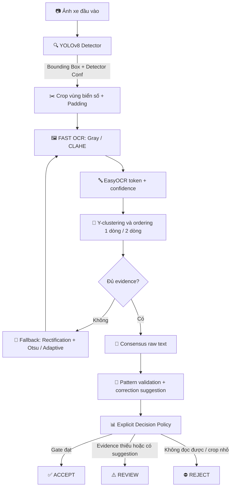

# 🚗 Vietnamese Automatic License Plate Recognition (VLPR) Platform

Hệ thống nhận diện biển số xe Việt Nam cho **ảnh tĩnh từ camera/cổng kiểm soát**, dựa trên **YOLOv8**, **OpenCV** và **EasyOCR**. Pipeline tách rõ bốn tầng: localization → raw OCR → pattern validation/suggestion → quyết định `ACCEPT`/`REVIEW`/`REJECT`.

Repository gồm package `src/`, REST API FastAPI, Web UI, CLI huấn luyện/đánh giá và Dockerfile chạy non-root. Ảnh dữ liệu, trọng số và artifact benchmark không được commit sẵn; README chỉ mô tả những gì code hiện thực.

---

## 🎯 Bảng Bằng Chứng Kỹ Thuật (Verified Evidence Matrix)

> [!IMPORTANT]
> **Phân biệt chỉ số & định dạng:**
> - **Detector mAP** (khả năng phát hiện bounding box) $\neq$ **OCR Accuracy** (độ chính xác nhận dạng chữ) $\neq$ **End-to-End Exact Recall** (độ chính xác toàn bộ pipeline từ ảnh xe đến chuỗi ký tự cuối cùng). Không dùng mAP detector để đại diện cho độ chính xác của toàn hệ thống ALPR.
> - **Format Validity** (`format_valid=True`: chuỗi khớp cú pháp rule-based Việt Nam) $\neq$ **Ground-Truth Correctness** (evaluator so sánh `accepted_prediction` với nhãn thật).
> - **EasyOCR Score** và `reliability_score` diagnostic không phải xác suất đã calibration; decision dùng các gate độc lập.

| Tuyên bố / Chỉ số | Giá trị xác minh | Artifact tái lập / Ghi chú |
|---|---:|---|
| **Detector mAP@0.50** | *Chưa công bố* | Chỉ headline khi artifact benchmark thực sự tồn tại |
| **Detector Recall@0.50** | *Chưa công bố* | Chỉ headline khi artifact benchmark thực sự tồn tại |
| **End-to-End Exact Recall** | *Chưa chạy benchmark công khai* | $E2ERecall = \frac{\text{Số biển GT phát hiện và đọc đúng 100\%}}{\text{Tổng số biển GT trong test set}}$ |
| **Exact Plate Accuracy (Raw OCR)** | *Chưa chạy benchmark công khai* | Yêu cầu file weights `models/best.pt` & dataset đầy đủ |
| **Exact Plate Accuracy (Suggestion)** | *Chưa chạy benchmark công khai* | Đề xuất chỉ là diagnostic, không tự động apply |
| **Character Error Rate (CER)** | *Chưa chạy benchmark công khai* | Artifact được tạo bởi evaluator |
| **Group Leakage Control (Protocol A)** | *Đo khi prepare dataset* | MD5/pHash/capture group được gộp trước split |
| **Plate-Identity Split (Protocol B)** | *Bắt buộc metadata* | `plate_identity` không được cross train/dev/test |
| **Ablation Benchmark** | *Chỉ trên development* | Không được dùng locked test để tune |
| **Automated Tests** | **22 test case hiện có** | Chạy `pytest` sau khi cài `requirements-dev.txt` |

---

## 🏗️ Quy Trình Pipeline 8 Giai Đoạn Canonical (Canonical 8-Stage Pipeline)

```text
1. DATASET & LEAKAGE CONTROL
   Vehicle / Plate Images  ──► Annotation Validation ──► pHash/MD5/DSU Grouping ──► Group/Identity-Aware Train/Val/Test
                                                                                            │
2. PLATE DETECTION                                                                         ▼
   Input Image ────────────► YOLOv8 Detector ────────► Bounding Box + Confidence
                                                                                            │
3. PLATE ROI PROCESSING                                                                    ▼
   Bounding Box ───────────► Crop + Padding ──────────► Initial Layout Hint (1-line / 2-line)
                                                                                            │
4. OCR PREPROCESSING                                                                       ▼
   Padded Crop ────────────► FAST: Gray / CLAHE ──► Fallback: Rectification + Otsu / Adaptive
                                                                                            │
5. OCR RECOGNITION                                                                         ▼
   Multi-Variants ─────────► EasyOCR Extraction ─────► OCR Tokens + Geometry + Confidence
                                                                                            │
6. TEXT RECONSTRUCTION                                                                     ▼
   OCR Tokens ─────────────► Token Filtering ─────────► 1-Line / 2-Line Geometric Ordering ──► Raw Plate String
                                                                                            │
7. VIETNAMESE PLATE VALIDATION                                                             ▼
   Raw String ─────────────► ASCII Normalization ────► Supported Pattern Validation ──► Correction Suggestion
                                                                                            │
8. FINAL OUTPUT & DECISION POLICY                                                          ▼
   Raw Consensus ──────────► Explicit Gates (detector/OCR/consensus/format) ──► ACCEPT / REVIEW / REJECT
```

### Flowchart Kiến Trúc Hệ Thống (Online Inference)



---

## 📊 Báo Cáo Ablation Benchmark (Baseline Ablation)

Bảng so sánh 5 cấu hình pipeline chính cùng khảo sát tỷ lệ Crop Padding Ratios ($0\%, 3\%, 5\%, 8\%, 10\%$):

| Phiên bản | Detector | Preprocessing OCR | Nắn ảnh (Deskew) | Hậu xử lý Template | Exact Accuracy (%) | CER | Mean Latency (ms) | P95 Latency (ms) |
|---|---|---|---|---|---:|---:|---:|---:|
| **B0** | YOLOv8 | Crop gốc | Không | Không | *Chưa đo* | *Chưa đo* | Baseline | Baseline |
| **B1** | YOLOv8 | Gray | Không | Không | *Chưa đo* | *Chưa đo* | Tiêu chuẩn | Tiêu chuẩn |
| **B2** | YOLOv8n | Gray + CLAHE rồi fallback threshold | Không | Không | *Chưa đo* | *Chưa đo* | Trung bình | Trung bình |
| **B3** | YOLOv8n | Adaptive cascade | Fallback (Perspective) | Không | *Chưa đo* | *Chưa đo* | Trung bình | Trung bình |
| **Final** | YOLOv8n | Adaptive cascade | Fallback (Perspective) | Suggestion only | *Chưa đo* | *Chưa đo* | *Chưa đo* | *Chưa đo* |

---

## 🛡️ Phân Tầng Model Layer & Decision Layer (API Response Architecture)

Dịch vụ REST API tách biệt rõ giữa **Model Layer** (nhận dạng thô & độ tin cậy mô hình) và **Decision Layer** (chính sách kiểm duyệt bãi xe):

```json
{
  "filename": "car_plate_sample.jpg",
  "latency_ms": 42.5,
  "predictions": [
    {
      "box": [120, 150, 310, 220],
      "padded_box": [112, 142, 318, 228],
      "class_id": 0,
      "detector_class": "license_plate",
      "detection_confidence": 0.95,
      "raw_text": "51F12B45",
      "normalized_text": "51F12B45",
      "accepted_text": null,
      "decision": "REVIEW",
      "policy_version": "1.0.0",
      "recognition": {
        "raw_text": "51F12B45",
        "normalized_text": "51F12B45",
        "text": "51F12B45",
        "format_valid": false,
        "template": "DDLDDDDD",
        "correction_cost": 1.0,
        "correction_suggestion": "51F12845",
        "correction_applied": false
      },
      "scores": {
        "detector_confidence": 0.95,
        "ocr_confidence": 0.88,
        "ocr_consensus_ratio": 0.75,
        "reliability_score": 0.79
      },
      "review": {
        "required": true,
        "reasons": ["FORMAT_INVALID", "CORRECTION_SUGGESTED"]
      },
      "latencies": {
        "image_pipeline_latency_ms": 42.5,
        "plate_ocr_latency_ms": 28.1,
        "detector_latency_ms": 14.4
      }
    }
  ]
}
```

Các trường phẳng là contract chính cho client hiện tại; các object
`recognition`, `scores`, `review`, `latencies` là bản trình bày theo tầng. Khi
`decision=ACCEPT`, `accepted_text` mới chứa raw text. Khi `REVIEW`, client nên
hiển thị raw text cùng `correction_suggestion` để operator xác nhận.

## 🗂️ Cấu trúc dự án

```text
src/
├── pipeline.py       # Detector, crop, quality gate và điều phối end-to-end
├── ocr.py            # OCR cascade, token ordering và consensus raw text
├── grammar.py        # Chuẩn hóa, template và correction suggestion
├── decision.py       # Chính sách ACCEPT / REVIEW / REJECT
├── dataset.py        # Manifest, DSU grouping và group-safe split
├── metrics.py        # IoU, OCR metrics, decision metrics và bootstrap CI
├── rectification.py  # Nắn phối cảnh fallback
└── config.py         # TrainingConfig và RecognitionConfig
app/
├── api.py            # FastAPI endpoints và response formatting
├── schemas.py        # Pydantic response contract
└── ui.html           # Dashboard upload ảnh
configs/              # Cấu hình YAML nhận diện/huấn luyện
resources/            # Template biển số và bảng nhầm lẫn OCR
tests/                # Unit/API tests
```

Các ngưỡng runtime nằm trong `configs/recognition.yaml`. Mặc định detector
giữ candidate từ `0.10`, nhưng chỉ `0.50` trở lên mới đủ gate detector cho
`ACCEPT`; OCR cần `0.65`, consensus cần `0.50`. Đây là hai mục đích khác nhau:
giữ candidate để không bỏ sót và chấp nhận tự động có kiểm soát.

### Các lý do kích hoạt kiểm duyệt thủ công (`review_reasons`):
- `LOW_DETECTION_SCORE`: Độ tin cậy phát hiện YOLOv8 thấp hơn ngưỡng cài đặt.
- `LOW_OCR_SCORE`: Độ tin cậy nhận dạng EasyOCR thấp.
- `FORMAT_INVALID`: Chuỗi raw không khớp mẫu biển số được hỗ trợ.
- `CORRECTION_SUGGESTED`: Có đề xuất sửa; policy v1 luôn yêu cầu REVIEW.
- `PLATE_TOO_SMALL`: Crop quá nhỏ, không đủ thông tin để chạy OCR.
- `VARIANT_DISAGREEMENT`: Tỷ lệ đồng thuận giữa các biến thể ảnh OCR thấp (`ocr_consensus_ratio < 0.50`).
- `UNREADABLE`: Không tạo được raw OCR có evidence.

---

## 🔒 Ngăn Ngừa Rò Rỉ Dữ Liệu (Leakage Control: Protocol A & Protocol B)

1. **Protocol A (Image-independent)**:
   - Sử dụng mã băm **MD5** và **Perceptual Hash (pHash)** với khoảng cách Hamming $\le 4$.
   - Gộp các nhóm ảnh liên thông bằng thuật toán **Disjoint Set Union (DSU)** trước khi chia tập train/val/test 70/15/15.
2. **Protocol B (Plate-identity independent)**:
   - Gộp tất cả các ảnh có cùng chuỗi biển số (`plate_identity` / `plate_text`) vào cùng một tập split.
   - Đảm bảo mô hình được đánh giá trên khả năng tổng quát hóa (Generalization) đối với các biển số xe chưa từng xuất hiện trong tập huấn luyện.

---

## 📋 Phạm Vi Hỗ Trợ & Ràng Buộc (Scope & Constraints)

### 🟢 Hỗ trợ hiện tại:
- Ảnh tĩnh: JPEG, PNG, WebP.
- Đa biển số xuất hiện trong cùng một ảnh.
- Biển số 1 dòng (ô tô dài) và 2 dòng (xe máy, ô tô ngắn) dân sự tiêu chuẩn Việt Nam.
- Quality gate mặc định: ảnh tối thiểu `160x120`, crop biển tối thiểu `20x8`, có kiểm tra độ nét và phơi sáng.

### 🔴 Chưa hỗ trợ / Ngoài phạm vi:
- Luồng video thời gian thực.
- Biển số ngoại giao (NG/QT), biển quân đội hoặc biển số màu đỏ/xanh đặc chủng.
- Cam kết độ chính xác khi ảnh bị che khuất hoặc góc nghiêng quá lớn chưa được benchmark.

---

## 🛠️ Cài Đặt & Chạy Thí Nghiệm (Quick Start)

### 1. Cài đặt môi trường ảo Python 3.11+:

```powershell
python -m venv .venv
.\.venv\Scripts\Activate.ps1
python -m pip install --upgrade pip
pip install -r requirements-dev.txt
```

### 2. Chuẩn bị dữ liệu YOLO:
Tạo dataset riêng theo cấu trúc `train/valid/test`, mỗi tập có `images/` và
`labels/`. Protocol B cần metadata chứa image key, `capture_group` hoặc
`capture_session_id`, và `plate_identity` hoặc `plate_identity_hash`.

```powershell
python prepare_dataset.py `
  --source data/raw `
  --metadata data/metadata.csv `
  --output dataset/grouped
```

Lệnh trên tạo `dataset/grouped/split_manifest.csv` và
`dataset/data.yaml`. Với dữ liệu legacy chưa có identity, chỉ dùng cờ
`--allow-legacy-identity` khi chạy thử, không dùng cho báo cáo Protocol B.

### 3. Huấn luyện, trọng số và export ONNX:
```powershell
python train.py --data dataset/data.yaml --config configs/train.yaml
```

Sau huấn luyện, dùng `weights/best.pt` trong thư mục run làm trọng số suy luận
(hoặc đặt bản sao tại `models/best.pt`). Export ONNX là tùy chọn:
```bash
python export_model.py --weights models/best.pt --imgsz 640
```

### 4. Chạy CLI hoặc REST API:
```powershell
python predict.py --weights models/best.pt --source sample/car.jpg --output outputs/prediction.jpg
```

Chạy REST API và Web UI Dashboard:
```bash
uvicorn app.api:app --host 0.0.0.0 --port 8000 --reload
```
- **Dashboard Web UI:** `http://localhost:8000/`
- **Swagger Docs:** `http://localhost:8000/docs`
- **Liveness Probe:** `GET /health/live`
- **Readiness Probe:** `GET /health/ready`

### 5. Đánh giá Development và Locked Test:
```bash
# Ablation/OCR tuning chỉ được chạy trên development.csv
python evaluate_ablation.py --weights models/best.pt --annotations data/e2e/development.csv

# Final E2E chỉ đọc locked test.csv sau khi đã freeze policy
python evaluate_end_to_end.py --weights models/best.pt --annotations data/e2e/test.csv
```

Hai file `data/e2e/*.csv` không được phân phối trong repository. Canonical
evaluator yêu cầu cột `split`: `development` cho ablation/OCR tuning và `test`
cho final E2E. Cờ `--allow-unlocked-annotations` chỉ dành cho dữ liệu legacy,
không dùng để báo cáo kết quả chính thức. Detector-only dùng:

```bash
python evaluate_detector.py --weights models/best.pt --data dataset/data.yaml
```

---

## 🗺️ Đốt Phá Kế Hoạch Nâng Cấp (Prioritized Roadmap)

| Mức ưu tiên | Hạng mục công việc | Trạng thái |
|:---:|---|:---:|
| 🔴 **P0** | Chuẩn hóa bảng Evidence Matrix & Ablation metrics dạng con số rõ ràng | ✅ Hoàn tất |
| 🔴 **P0** | Phân định `format_valid` $\neq$ `recognition_correct` & Phân tầng Latency (`image` vs `plate`) | ✅ Hoàn tất |
| 🔴 **P0** | Chuẩn hóa cấu trúc Model Layer vs Decision Layer trong REST API | ✅ Hoàn tất |
| 🟠 **P1** | Hỗ trợ Protocol B Split (Plate-Identity Aware DSU) | ✅ Hoàn tất |
| 🟠 **P1** | Đánh giá đồng thuận OCR & explicit ACCEPT/REVIEW/REJECT policy | ✅ Hoàn tất |
| 🟠 **P1** | Module hóa quy tắc biển số trong `resources/plate_templates.yaml` & `resources/ocr_confusions.yaml` | ✅ Hoàn tất |
| 🟠 **P1** | Thống kê Positional Character Accuracy, Confusion Matrix & Bootstrap 95% CIs | ✅ Hoàn tất |
| 🟡 **P2** | Thử nghiệm mô hình chuyên dụng biển số (LPRNet / CRNN / PARSeq) | ⏳ Lập kế hoạch |
| 🟡 **P2** | Tracking theo luồng Video (ByteTrack / SORT) & Temporal Consensus Voting | ⏳ Lập kế hoạch |

---

## 📜 Giấy Phép (License)

Dự án phát hành theo giấy phép [MIT License](LICENSE).
